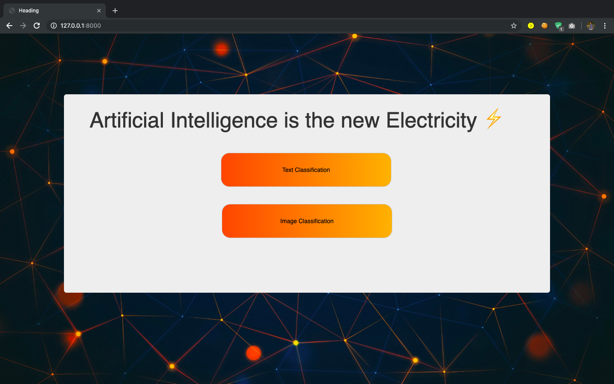
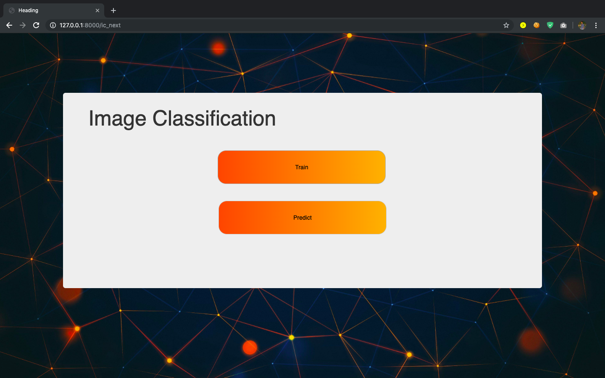
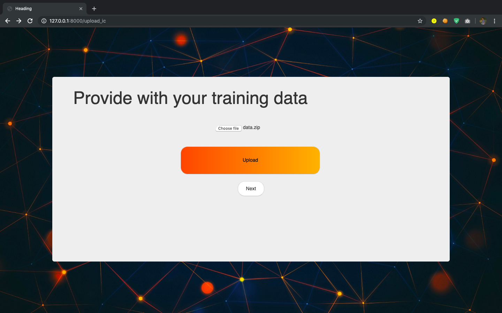
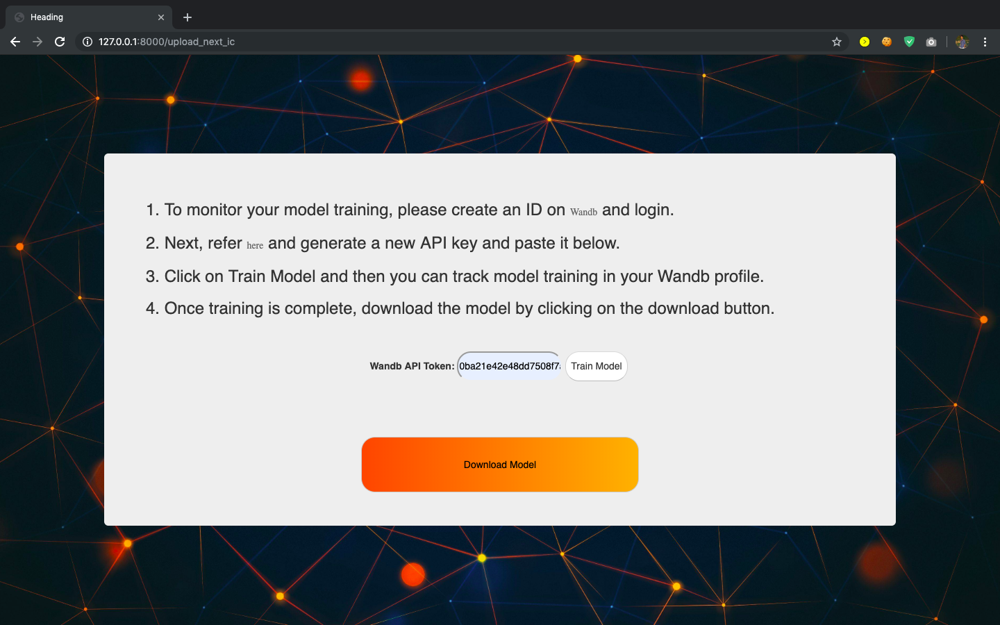
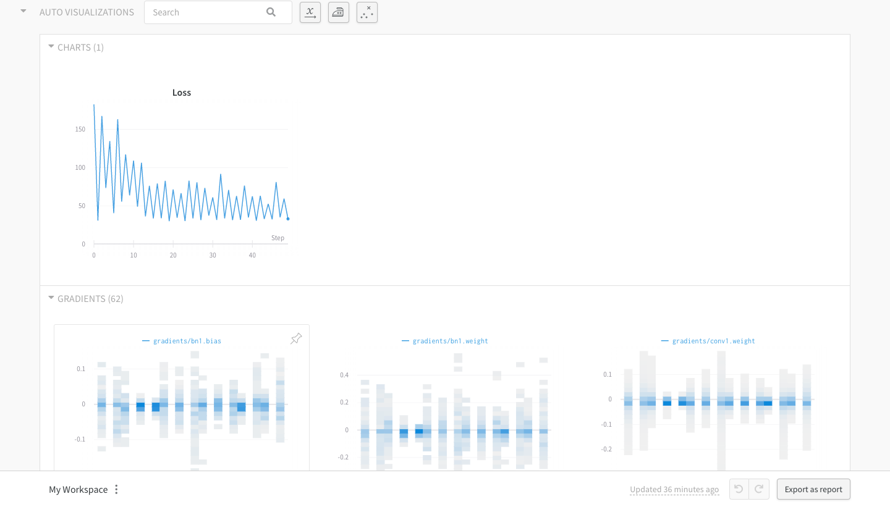

# Web-app-to-Train-and-Test-Machine-Learning-Models
A Django web app developed to make the process of training and testing a Machine Learning model easier.

Currently supports the following functionalities-
1. Train and test a Text Classification ULMFiT model (Fastai).
2. Train an Image Classifier by fine-tuning ResNet18 pre-trained model (Pytorch).
3. Live tracking of model metrics like- training loss, gradients etc. using [Weights and Biases](https://www.wandb.com/)

Future work-
1. Add hyper-parameter tuning to enable the user to configure his model.
2. Improve front-end.

The working of web app is as-

1. Choose your application.

2. Choose if you want to train or test the model.

3. Upload your training data in a zip file.

4. Follow the instuctions as shown.

5. Open your wandb account and track model training.

